# Moonbreaker API and data-flow runbook

This is the canonical operational map for gameplay data used by Moonbreaker. It covers the path from Star Citizen extraction through Scintel, Moonbreaker's server-only registries, routed endpoints, and browser consumers.

Use this document for day-to-day publication and incident response. Use [Generated Data Manifest](generated-data-manifest.md) for the data-authority registry. Scintel's matching extraction and handoff instructions live in `D:\scintel\docs\moonbreaker-publication-runbook.md`.

## The boundary

Moonbreaker has one supported runtime boundary:

```text
accepted Scintel snapshot -> Moonbreaker shaping/publication -> server-data -> route handler -> browser consumer
```

The following rules are non-negotiable:

- `public/api` stays empty.
- Browser code calls routed endpoints. It never fetches generated JSON by filename.
- Raw Scintel monoliths, Foundry records, reports, and debug artifacts never enter the web root.
- Publication always names an accepted Scintel channel and build.
- Generated files are replaced by their generator or publication command, never hand-edited.
- Fitting cache identity retains channel and build ID.
- User inventory and queue state remain authenticated database data; they are not generated Scintel artifacts.
- `npm run api:check` is a required publication and deployment gate.

Historical audits may describe retired static files. They are evidence, not operating instructions.

## End-to-end map

```mermaid
flowchart LR
    P4K["Star Citizen Data.p4k"] --> INGEST["Scintel ingest"]
    INGEST --> DCB["game2.dcb + build manifest"]
    DCB --> FOUNDRY["unforge Foundry records"]
    FOUNDRY --> BUILDERS["Scintel domain builders"]
    BUILDERS --> SNAPSHOT["accepted out/CHANNEL/BUILD_ID/datasets"]
    SNAPSHOT --> REVIEW["validation + before/after diff review"]
    REVIEW --> SHAPE["explicit Moonbreaker shaping/publication"]
    SHAPE --> SD["server-data domain registries"]
    SD --> ROUTES["Moonbreaker API route handlers"]
    ROUTES --> ADAPTERS["Vercel / Vite / standalone adapters"]
    ADAPTERS --> CLIENTS["Crafting / Build Queue / Mining / Fitting / Missions"]
    DB["authenticated user database"] --> USERAPI["user-state API routes"]
    USERAPI --> CLIENTS
```



The accepted snapshot is immutable input for a publication. Scintel's `out/<CHANNEL>/current.json` identifies its active build, but production work should resolve that pointer and then use the explicit `datasetRoot` and `activeBuildId` recorded in it.

## Source-to-endpoint map

| Product area | Scintel or external source | Moonbreaker registry | API surface | Primary browser consumer |
| --- | --- | --- | --- | --- |
| Vehicle and FPS recipes | `datasets/crafting/blueprints.json`, `datasets/crafting/fps/fps_blueprints.json` | `server-data/crafting/recipes` | `/api/crafting/recipes/*` | `src/lib/craftingRecipesApi.ts` |
| Component cards and fitting-backed crafting statistics | `datasets/crafting/component_card_index.json`, current recipes, current fitting registries | `server-data/crafting/component-cards` | `/api/crafting/component-cards/*` | `src/lib/componentCardIndexApi.ts`, shared fitting component store |
| Crafting reference data | accepted crafting and mining reference outputs | `server-data/crafting/reference` | `/api/crafting/reference/*` | `src/lib/craftingReferenceApi.ts`, refinery/OCR helpers |
| Blueprint sources and rewards | accepted mission outputs, shaped mission source | `server-data/crafting/blueprint-sources` | `/api/crafting/blueprint-sources*`, `/api/crafting/blueprint-rewards/*` | `src/lib/craftingBlueprintSourcesApi.ts`, Blueprint Tracker |
| Missions | `datasets/missions`, `datasets/ref_index.json` | `server-data/missions/source`, then shaped mission shards | `/api/missions/*` | `src/lib/missionData.ts` |
| Mining indexes | `datasets/recommendations`, `datasets/mining` | `server-data/mining/indexes` | mining index endpoints | `src/features/mining/staticMiningIndex.ts` |
| Mining recommendations | material scores and quality-enriched sources | `server-data/mining/recommender` | `POST /api/mining/recommendations` | `src/features/mining/recommenderAdapter.ts` |
| Lagrange locations | generated Lagrange files plus accepted `ref_index.json` | `server-data/mining/locations` | `/api/mining/lagrange-*` | `src/features/locations/stantonLagrangeChildren.ts` |
| Fitting | `datasets/fitting` | `server-data/fitting/<CHANNEL>/<BUILD_ID>` plus `current.json` | `/api/v1/fitting/*` | `src/lib/fitting/fittingApi.ts`, shared fitting component store |
| Build Queue requirements | routed recipe/reference services and request state | calculated server response | `POST /api/build-queue/requirements` | `src/features/buildQueue/buildQueueRequirementsApi.ts` |
| Refinery yields | external import, not Scintel authority | `server-data/crafting/reference/refinery-yields.json` | `/api/crafting/reference/refinery-yields` | `src/lib/refineryData.ts` |
| Inventory and saved user state | authenticated database | database records | `/api/user/*` | online persistence, inventory, queue, saved blueprint, and tracker clients |

## Endpoint catalog

### Crafting recipes

| Method | Endpoint | Purpose |
| --- | --- | --- |
| `GET` | `/api/crafting/recipes/index` | Small identity and kind index used before enumeration. |
| `POST` | `/api/crafting/recipes/batch` | Resolve up to 100 recipe IDs per request. |
| `GET` | `/api/crafting/recipes/:id` | Resolve one recipe shard. |

The browser must not request a full recipe catalog monolith. Full enumeration reads the small index and then uses chunked batch requests.

### Component cards and crafting references

| Method | Endpoint | Purpose |
| --- | --- | --- |
| `GET` | `/api/crafting/component-cards/index` | Component-card identity index. |
| `GET` | `/api/crafting/component-cards/facets` | Filter facets. |
| `GET` | `/api/crafting/component-cards/browse` | Browse projection. |
| `GET` | `/api/crafting/component-cards/:id` | One component-card detail record. |
| `GET` | `/api/crafting/reference/crafted-properties` | Crafted property definitions. |
| `GET` | `/api/crafting/reference/quality-quantization` | Crafting quality quantization. |
| `GET` | `/api/crafting/reference/material-quality-quantization` | Material quality options. |
| `GET` | `/api/crafting/reference/material-identity` | Canonical material identity mapping. |
| `GET` | `/api/crafting/reference/refinery-yields` | Imported refinery yield reference. |

### Blueprint sources and mission rewards

| Method | Endpoint | Purpose |
| --- | --- | --- |
| `GET` | `/api/crafting/blueprint-sources/index` | Blueprint source index. |
| `GET` | `/api/crafting/blueprint-sources?blueprintGuid=...` | Sources for one blueprint. |
| `POST` | `/api/crafting/blueprint-sources/batch` | Sources for up to 100 blueprint IDs. |
| `GET` | `/api/crafting/blueprint-rewards/release-state` | Reward release-state projection. |
| `GET` | `/api/crafting/blueprint-rewards/missions` | Reward-bearing missions. |
| `GET` | `/api/crafting/blueprint-rewards/missions/:contractId` | Reward detail for one mission contract. |

### Mining and locations

The read endpoints support `GET` and `HEAD`.

| Method | Endpoint | Purpose |
| --- | --- | --- |
| `GET` | `/api/mining/location-materials` | Materials available by location. |
| `GET` | `/api/mining/encounter-rankings` | Material encounter ranking. |
| `GET` | `/api/mining/material-quality` | Material quality distributions. |
| `GET` | `/api/mining/location-distribution` | Location distribution index. |
| `GET` | `/api/mining/location-hierarchy` | Mining location hierarchy. |
| `GET` | `/api/mining/lagrange-groups` | Lagrange group projection. |
| `GET` | `/api/mining/lagrange-children` | Lagrange child locations. |
| `POST` | `/api/mining/recommendations` | Server-side recommendation scoring. |

Production and development use the same recommendation route. There is no production-only static-data bypass.

### Missions

| Method | Endpoint | Purpose |
| --- | --- | --- |
| `GET` | `/api/missions/browser` | Mission browser index. |
| `GET` | `/api/missions/family/:familyId` | Mission family detail. |
| `GET` | `/api/missions/family/:familyId/variants` | Variants within a family. |
| `GET` | `/api/missions/variant/:variantId` | One mission variant. |
| `POST` | `/api/missions/variant/:variantId/eligibility` | Eligibility evaluation. |
| `POST` | `/api/missions/variant/:variantId/prerequisite-path` | Prerequisite path calculation. |

The singular `family` and `variant` routes are canonical. Compatibility aliases are not publication contracts.

### Fitting

Read endpoints support `GET` and `HEAD`. Requests may select channel/build context; otherwise the server resolves `server-data/fitting/current.json`.

| Method | Endpoint | Purpose |
| --- | --- | --- |
| `GET` | `/api/v1/fitting/meta` | Active fitting dataset metadata. |
| `GET` | `/api/v1/fitting/ships` | Ship index. |
| `GET` | `/api/v1/fitting/ships/:shipId` | Ship detail. |
| `GET` | `/api/v1/fitting/ships/:shipId/hardpoints` | Ship hardpoints. |
| `GET` | `/api/v1/fitting/ships/:shipId/loadout` | Default or resolved loadout. |
| `GET` | `/api/v1/fitting/ships/:shipId/calculations` | Delivered ship calculations. |
| `GET` | `/api/v1/fitting/ships/:shipId/ports/:portId/compatible-components` | Port compatibility. |
| `GET` | `/api/v1/fitting/components` | Component index. |
| `GET` | `/api/v1/fitting/components/:componentId` | Component detail. |
| `GET` | `/api/v1/fitting/ammo/:ammoId` | Ammunition detail. |
| `POST` | `/api/v1/fitting/validate` | Validate a proposed fitting. |
| `POST` | `/api/v1/fitting/calculate` | Calculate a proposed fitting. |

Fitting-detail consumers must use the shared fitting component store. Direct low-level component requests from page components bypass persistent cache identity and are unsupported.

### Build Queue and user state

| Method | Endpoint | Purpose |
| --- | --- | --- |
| `POST` | `/api/build-queue/requirements` | Calculate queue requirements from routed gameplay data. |
| `GET` | `/api/user/inventory` | Read inventory. |
| `PUT`, `POST` | `/api/user/inventory/sync` | Synchronize inventory. |
| `POST` | `/api/user/inventory/stacks` | Create a physical inventory record. |
| `PATCH`, `DELETE` | `/api/user/inventory/stacks/:id` | Edit or delete a physical inventory record. |
| `DELETE` | `/api/user/inventory/locations/:id` | Delete an inventory location. |
| `DELETE` | `/api/user/inventory/build-queues/:id` | Remove inventory state associated with a queue. |
| `GET`, `POST`, `PATCH`, `DELETE` | `/api/user/build-queue` | Persist Build Queue state. |
| `GET`, `POST`, `DELETE` | `/api/user/saved-blueprints` | Persist saved blueprints. |
| `GET`, `PUT` | `/api/user/blueprint-tracker` | Read or replace Blueprint Tracker state. |

All `/api/user/*` routes require the authenticated user context. They are not safe sources for public caching.

## Normal publication procedure

### 1. Pin the accepted Scintel snapshot

From PowerShell:

```powershell
$pointer = Get-Content -Raw D:\scintel\out\LIVE\current.json | ConvertFrom-Json
$buildId = $pointer.activeBuildId
$datasetRoot = $pointer.datasetRoot
Write-Host "Publishing LIVE $buildId from $datasetRoot"
```

Confirm that review and validation were performed for exactly that build. Do not continue if the pointer changes during the publication window.

### 2. Shape crafting registries

For a complete patch, shape recipes, component cards, and references before missions. This lets mission shaping use the new component-card browse projection:

```powershell
Set-Location D:\Moonbreaker
$env:SCINTEL_DATASET_ROOT = $datasetRoot
npm run crafting:shape-component-cards
npm run crafting:shape-recipes
npm run crafting:shape-reference
```

`SCINTEL_DATASET_ROOT` is required. `SCINTEL_COMPONENT_CARD_SOURCE` is an optional explicit override and must still identify an accepted source.

If missions did not change, refresh blueprint sources from the already accepted mission source with `npm run crafting:shape-blueprint-sources`. If missions changed, the next step refreshes them after publishing the new mission source.

### 3. Publish missions

The Scintel publisher copies the six owned mission sources into Moonbreaker's server-only source boundary, verifies hashes, shapes mission shards, and refreshes blueprint-source projections:

```powershell
Set-Location D:\scintel
pwsh -File scripts/publish/publish_mission_api_to_moonbreaker.ps1 `
  -SourceDir "$datasetRoot\missions" `
  -RefIndex "$datasetRoot\ref_index.json"
```

Always pass `-SourceDir` and `-RefIndex`. Do not rely on a legacy repository-level default.

After mission publication, validate both cross-domain projections:

```powershell
Set-Location D:\Moonbreaker
npm run crafting:component-cards:verify
npm run crafting:blueprint-sources:verify
```

### 4. Publish mining and Lagrange data

```powershell
Set-Location D:\Moonbreaker
$env:SCINTEL_API_ROOT = $datasetRoot
$env:SCINTEL_REF_INDEX = "$datasetRoot\ref_index.json"
npm run mining:publish
```

The environment variable name `SCINTEL_API_ROOT` is retained by this publisher for compatibility. Its value must be the accepted build's `datasets` directory, never `D:\scintel\api`. Supplying `SCINTEL_REF_INDEX` prevents accidental cross-build location generation.

### 5. Promote fitting when fitting changed

Fitting is channel/build-owned and currently has an explicit promotion step:

```powershell
Set-Location D:\Moonbreaker
$source = Join-Path $datasetRoot 'fitting'
$target = Join-Path 'server-data\fitting\LIVE' $buildId

if (Test-Path -LiteralPath $target) {
  throw "Refusing to overwrite existing fitting build: $target"
}

Copy-Item -LiteralPath $source -Destination $target -Recurse
node --import tsx scripts/shard-compatibility-rules.mts `
  (Join-Path $target 'compatibility_rules.json')
npm run fitting:test
```

Only after the copied build passes validation should `server-data/fitting/current.json` be updated to select that exact build. Commit the new build directory and pointer together. Never replace another build directory in place.

### 6. Handle refinery data separately

Refinery yields are external imported data, not a Scintel publication product. Preserve the current file unless the external source was intentionally refreshed. A deliberate refresh uses:

```powershell
Set-Location D:\Moonbreaker
npm run refinery:import
npm run refinery:validate
```

Record the external source and its retrieval date in the same change.

### 7. Run gates before commit or deployment

```powershell
Set-Location D:\Moonbreaker
npm run api:check
npm run content:check
npm run crafting:test
npm run fitting:test
npm run mining:test
npm run missions:test
npm run refinery:validate
npm run lint
npm run build
```

Run the domain tests for every changed registry. `api:check`, lint, and build are final cross-domain gates. Publication is not complete merely because files were generated.

### 8. Record the handoff

The Moonbreaker commit or deployment record must identify:

- channel and build ID;
- resolved Scintel dataset root;
- Scintel diff/report path and validation result;
- domains published;
- commands/tests run;
- any intentionally preserved domain, such as refinery;
- Moonbreaker commit and deployment identifier.

## Deployment adapters

| Runtime | Adapter | Notes |
| --- | --- | --- |
| Vercel | `api/crafting/[...path].ts`, `api/mining/[...path].ts`, `api/missions/[...path].ts`, `api/v1/fitting/[...path].ts` | `vercel.json` includes the required `server-data` roots and rewrites public URLs to catchalls. |
| Vite development | middleware in `vite.config.ts` | Serves the routed development contract from server data. It must not proxy static generated JSON. |
| Standalone server | `server/index.ts` | Handles fitting, missions, mining, Build Queue requirements, and user state. Its current route coverage is not identical to Vercel/Vite; verify a route is mounted before using this runtime for crafting API testing. |
| Browser | `apiUrl(...)` and domain clients | Calls same-origin routed endpoints. MSW may mock route responses, but must not reintroduce static file fallbacks. |

## Incident checklist

When data looks stale, missing, or unexpectedly huge:

1. Run `npm run api:check`. Any file under `public/api` is a regression.
2. Resolve Scintel's accepted `current.json`; compare its build ID with the Moonbreaker fitting pointer and generated manifests.
3. Check the affected route directly, not a file URL.
4. Confirm the route is reading its documented `server-data` root.
5. Confirm the publication used explicit dataset and reference-index paths from the same build.
6. Check Scintel's validation report, unresolved-reference reports, and diff before reshaping.
7. Regenerate with the owned command. Do not patch generated JSON by hand.
8. Run the domain tests and build before deploying the correction.

If extraction contains a new record but the endpoint does not, inspect the domain builder's coverage reports. That is normally a projection/builder coverage issue, not permission to add frontend inference.

## Ownership summary

- Scintel owns extraction, Foundry normalization, domain generation, accepted snapshots, and source validation.
- Moonbreaker shaping scripts own route-optimized server registries.
- Moonbreaker route handlers own runtime response contracts.
- Browser domain clients own transport and caching, not gameplay truth.
- The authenticated database owns inventory, saved user state, and persisted Build Queue state.
- External imported sources retain explicit provenance and may not silently replace Foundry-derived truth.
