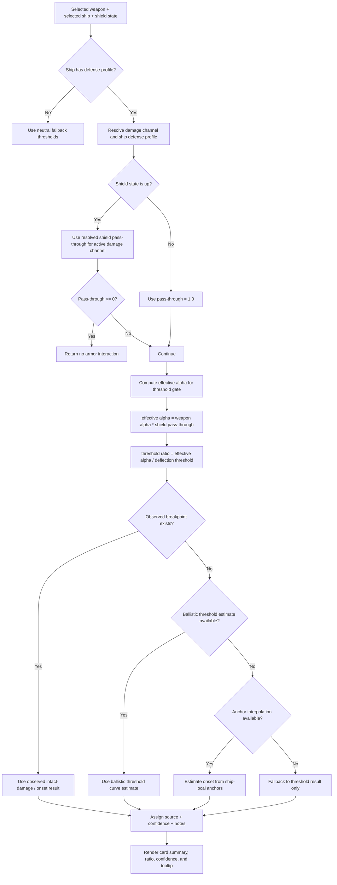

# Alpha Threshold Analysis

This folder contains the PTU-biased shield-aware armor analysis workflow used by the `Analysis` tab in the armor thresholds tool.

The current goal is not a generic live/PTU comparison surface. It is a PTU validation workspace for:

- armor thresholds
- armor damage multipliers
- shield pass-through behavior
- observed breakpoint overrides

## What This Section Does

The analysis page answers a narrow question:

> For a selected weapon and selected ship, when does that weapon begin damaging armor, and does it damage intact armor immediately?

The page renders:

- one row per selected weapon
- up to four ship columns
- one compact armor interaction panel per weapon/ship matchup

The main entry points are:

- [AlphaThresholdToolPage.tsx](Moonbreaker/src/tools/alpha-threshold/AlphaThresholdToolPage.tsx)
- [ThresholdHeatmapBoard.tsx](Moonbreaker/src/tools/alpha-threshold/components/ThresholdHeatmapBoard.tsx)
- [ArmorInteractionTestbed.tsx](Moonbreaker/src/tools/alpha-threshold/components/ArmorInteractionTestbed.tsx)
- [ArmorInteractionSummaryPanel.tsx](Moonbreaker/src/tools/alpha-threshold/components/ArmorInteractionSummaryPanel.tsx)
- [calculations.ts](Moonbreaker/src/tools/alpha-threshold/lib/calculations.ts)

## PTU-Only Assumption

Right now the analysis workflow is intentionally locked to PTU assumptions.

That means:

- PTU ship defense profiles are treated as the active source of truth
- live import issues are intentionally ignored for this patch cycle
- observed breakpoints are used to override PTU inference where tested facts disagree with raw imported values

The PTU lock is wired in:

- [useAlphaThresholdState.ts](Moonbreaker/src/tools/alpha-threshold/hooks/useAlphaThresholdState.ts)
- [TopControlStrip.tsx](Moonbreaker/src/tools/alpha-threshold/components/TopControlStrip.tsx)

## Data Sources

The page combines four layers of information.

### 1. Weapon data

Weapons come from the normalized weapon dataset and are surfaced to the calculator as `WeaponRecord`.

Important fields:

- `alpha`
- `damageType`
- `weaponClass`
- `projectileSpeed`
- `calculatorProfile.baseAlpha`

### 2. Ship defense data

Ships carry a resolved `defenseProfile` with:

- armor thresholds by channel
- armor damage multipliers by channel
- shield pass-through by channel
- optional observed breakpoint overrides

Relevant files:

- [ships.ts](Moonbreaker/src/tools/alpha-threshold/data/ships/ships.ts)
- [erkulPtuShipDefenseProfiles.ts](Moonbreaker/src/tools/alpha-threshold/data/shields/erkulPtuShipDefenseProfiles.ts)

### 3. Observed breakpoint overrides

Observed data is curated, sparse, and intentionally stronger than inference.

It is used when:

- you have direct onset data like `starts at 80%`
- you know a weapon does or does not damage intact armor
- you want a tested fact to override raw threshold math

Relevant file:

- [observedBreakpoints.ts](Moonbreaker/src/tools/alpha-threshold/data/ships/observedBreakpoints.ts)

### 4. Derived estimation logic

If a matchup has no direct observed breakpoint, the calculator falls back to threshold math or ship-local anchor estimation.

Relevant file:

- [calculations.ts](Moonbreaker/src/tools/alpha-threshold/lib/calculations.ts)

## Current Model Rules

These rules matter because they explain why the page produces the values it does.

### Threshold gating uses raw alpha

The current model checks deflection threshold against raw incoming alpha, not armor multiplier-adjusted alpha.

Current threshold gate:

- shields down: `weapon alpha / deflection threshold`
- shields up: `weapon alpha * shield pass-through / deflection threshold`

This was changed after validating cases like:

- `NDB-30` vs `Perseus`
- `NDB-30` vs `Guardian`

That observation showed that armor damage multipliers should not be used to determine whether a hit clears intact armor.

### Armor damage multipliers are still retained

`armorDamageMultiplier` is still carried through the estimate result because it is useful for later damage modeling, but it is not currently used to decide:

- `Intact Armor: Yes/No`
- `Starts At X%`

### Shield handling is channel-specific

The calculator does not hardcode “energy fails shields” globally.

It uses resolved shield pass-through for the active damage channel:

- if `shield pass-through <= 0`, armor interaction short-circuits to no interaction
- otherwise the pass-through value is used in threshold gating

### Observed data wins

If a curated observed breakpoint exists, it overrides threshold inference.

That is how mismatches between imported PTU data and tested facts are handled safely.

## Flowchart

## UI Structure

The current analysis layout is organized as:

1. Board shell
2. Top control strip
3. Ship header band
4. Weapon rows
5. One panel per weapon/ship matchup

Rendering path:

- [ThresholdHeatmapBoard.tsx](Moonbreaker/src/tools/alpha-threshold/components/ThresholdHeatmapBoard.tsx)
  - owns the main `Analysis / Weapons Loadout` tabs
  - owns analysis-local chip filtering and related-weapon suggestions
- [ArmorInteractionTestbed.tsx](Moonbreaker/src/tools/alpha-threshold/components/ArmorInteractionTestbed.tsx)
  - builds the weapon-row x ship-column grid
  - caps visible ships at four
  - manages local active-cell hover/focus state
- [ArmorInteractionSummaryPanel.tsx](Moonbreaker/src/tools/alpha-threshold/components/ArmorInteractionSummaryPanel.tsx)
  - renders the compact armor interaction panel
  - computes and displays the per-state estimates
  - owns tooltip formatting and in-card chips

## Reading the Cards

Each compact panel is answering:

- `Intact Armor`: does this weapon damage fresh armor immediately?
- `Effective Damage`: how strong is this matchup relative to threshold?
- `Effective Alpha` : What is the alpha reduced to when encountering shields and armor?
- `Deflection Threshold` : What is the base alpha armor will disregard entirely?
- `Threshold Ratio` : Antecedent represents ratio below threshold. Consequent represents alpha above.
- `Confidence` : Has this data been observed, estimated, or unknown.

Interpretation priority:

1. `Intact Armor` The armor is undamaged. 
2. `Effective Damage` How much total damage contribution over time the weapon system provides on a kill.

Observed or estimated onset is then explained by the summary line and tooltip.

## Chip Filtering

Phase 1 chip filtering is analysis-local.

Clickable chips can:

- filter visible selected weapons to similar entries
- show related suggestions
- let the user swap a suggested weapon into the originating slot

This is intentionally scoped to the analysis page. It does not replace the drawer-based loadout workflow.

## Known Constraints

- Observed breakpoint coverage is still sparse and curated
- PTU is the only trusted environment during this patch cycle
- Live import issues are intentionally deferred until the patch goes live

## When To Change The Model

Change the model in [calculations.ts](Moonbreaker/src/tools/alpha-threshold/lib/calculations.ts) when:

- a tested fact disagrees with threshold inference
- a shield interaction rule is wrong for a damage channel
- a ship-specific anchor curve becomes available

Change [observedBreakpoints.ts](Moonbreaker/src/tools/alpha-threshold/data/ships/observedBreakpoints.ts) when:

- you have real observed armor onset values
- you know a weapon definitely does or does not damage intact armor
- you want to override inference with a tested fact

## Validation Workflow

Before trusting a new behavior:

1. Verify the ship armor thresholds and damage multipliers against normalized data.
2. Verify shield pass-through assumptions for the active damage channel.
3. Check whether an observed breakpoint should override the raw threshold result.
4. Confirm the result in the analysis card.

## Future 

Follow-up cleanup targets:

- remove dead tooltip equation code in [ArmorInteractionSummaryPanel.tsx](Moonbreaker/src/tools/alpha-threshold/components/ArmorInteractionSummaryPanel.tsx)

- clean remaining mojibake text in weapon-row labels
- expand observed breakpoint coverage beyond the current curated set
- re-enable a true live environment after patch lands, live data is audited
